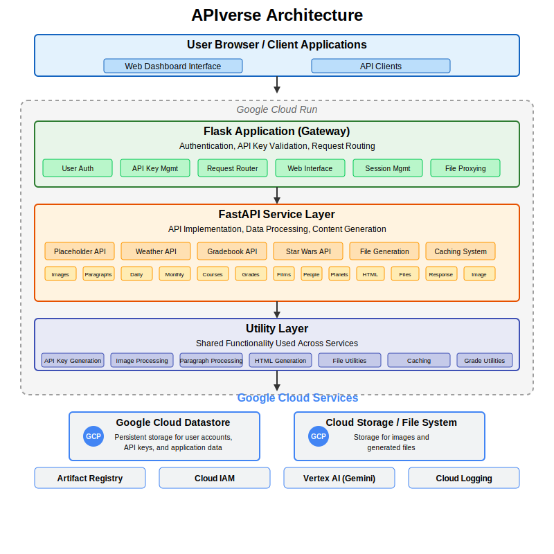

# APIverse

A comprehensive API hub for PSU students, providing reliable placeholder, weather, gradebook, and Star Wars API endpoints with secure authentication.

## Table of Contents

- [Overview](#overview)
- [Features](#features)
- [Tech Stack](#tech-stack)
- [Technical Architecture](#technical-architecture)
- [Project Structure](#project-structure)
- [API Reference](#api-reference)
  - [Placeholder Image API](#placeholder-image-api)
  - [Paragraph API](#paragraph-api)
  - [Weather API](#weather-api)
  - [Gradebook API](#gradebook-api)
  - [Star Wars API](#star-wars-api)
- [Authentication](#authentication)
- [Installation & Setup](#installation--setup)
- [Local Development](#local-development)
- [Deployment](#deployment)
- [Security Considerations](#security-considerations)
- [Contributing](#contributing)
- [Example API Usage](#example-api-usage)

## Overview

APIverse is a Software Engineering Project that provides PSU students with a local API hub, replicating useful placeholder APIs, weather data APIs, gradebook management, and Star Wars API endpoints. The system ensures reliability, security with API key authentication, and is designed for cost-effective cloud deployment using Docker and Google Cloud Platform's Cloud Run.

## Features

### Core Features

- **User Authentication**: Secure signup, login, and account management for PDX users with OAuth integration
- **API Key Management**: Generation, validation, and revocation of API keys
- **Placeholder APIs**:
  - Image generation with customizable dimensions and categories
  - Paragraph text generation with variable themes, lengths, and counts
  - AI-powered text generation using Google's Gemini model
- **Weather API**:
  - Daily weather forecasts with randomized but reproducible data
  - Monthly weather data with appropriate seasonal variations
- **Gradebook API**:
  - Course creation with customizable grading components
  - Student grade generation with realistic distributions
  - Multiple output formats (JSON, HTML, downloadable)
- **Star Wars API**: Re-implementation of swapi.dev with enhanced data and search functionality

### Technical Features

- Two-tier architecture (Flask frontend, FastAPI backend)
- Google Cloud Datastore for persistent storage
- Secure API key generation with salted hashing
- Caching system for optimized performance
- File generation and download capabilities
- Responsive web interface with interactive documentation
- Password reset system with email verification
- Integration with Google's Vertex AI (Gemini model) for LLM-generated text

## Tech Stack

### Core Technologies

- **Python 3.11**: Primary programming language
- **Flask**: Frontend web framework for user interface and gateway
- **FastAPI**: Backend API framework with built-in OpenAPI documentation
- **Jinja2**: Template engine for HTML rendering
- **Google Cloud Platform**: Cloud provider for hosting and services

### Frontend

- **HTML/CSS**: Custom-designed responsive web interface
- **JavaScript**: Client-side interactivity and API testing
- **Swagger UI**: Interactive API documentation
- **ReDoc**: Alternative API documentation viewer

### Backend

- **Uvicorn**: ASGI server for FastAPI
- **Werkzeug**: WSGI web application library used by Flask
- **Pydantic**: Data validation and settings management
- **requests**: HTTP library for API communication

### Google Cloud Services

- **Cloud Datastore**: NoSQL database for user data and API keys
- **Cloud Run**: Serverless container runtime
- **Artifact Registry**: Container image storage
- **Cloud IAM**: Identity and access management
- **Vertex AI**: Machine learning platform (Gemini model)

### Authentication & Security

- **Google OAuth**: Authentication via Google accounts
- **SHA-256**: Secure hashing for API keys
- **Secrets**: Secure random token generation
- **SMTP**: Email service for password reset

### Image Processing

- **Pillow**: Python Imaging Library for image resizing and manipulation

### Data Generation & Utilities

- **Faker**: Generation of realistic student names
- **Random**: Randomized data generation with seeded consistency
- **UUID**: Generation of unique identifiers

### Development & Deployment

- **Docker**: Containerization for consistent deployment
- **dotenv**: Environment variable management
- **Google Cloud SDK**: CLI tools for GCP deployment

## Technical Architecture

APIverse employs a two-tier architecture:

1. **Frontend/Gateway Layer** (Flask):

   - User authentication and session management
   - Google OAuth integration for social login
   - API key generation and validation
   - Request routing and endpoint security
   - Web interface for user interaction
   - Password reset functionality with email verification

2. **Backend/Service Layer** (FastAPI):

   - Core API functionality
   - AI integration for text generation
   - Data processing and response formatting
   - Resource transformation (image resizing, file generation)
   - Caching for performance optimization
   - OpenAPI documentation with Swagger UI

3. **Data Layer** (Google Cloud Datastore):

   - User accounts and authentication data
   - API key storage with secure hashing
   - Persistent data for APIs (weather, courses, Star Wars entities)
   - Object mapping and querying

4. **Google Cloud Platform**:
   - Cloud Run for containerized deployment
   - Artifact Registry for Docker image storage
   - Vertex AI for Gemini LLM integration
   - Cloud IAM for service account management



## Project Structure

```
src/
├── app.py                   # Main Flask application entry point
├── run.py                   # Development runner script
├── app/                     # Flask view controllers
│   ├── __init__.py
│   ├── dashboard.py         # API key management interface
│   ├── index.py             # Homepage controller
│   ├── login.py             # User authentication
│   ├── logout.py            # Session management
│   ├── signup.py            # User registration
│   ├── reset_request.py     # Password reset request handler
│   ├── verify_otp.py        # OTP verification for password reset
│   └── reset_password.py    # Password reset completion
├── auth/                    # OAuth authentication
│   ├── __init__.py
│   ├── callback.py          # OAuth callback handler
│   ├── login.py             # OAuth login initiator
│   └── logout.py            # OAuth logout handler
├── model/                   # Data access layer
│   ├── __init__.py
│   └── model_datastore.py   # Google Cloud Datastore integration
├── services/                # API implementations
│   ├── __init__.py
│   ├── fastapi_service.py   # Main FastAPI application
│   ├── gradebook_service.py # Course and student grade generation
│   ├── weather_service.py   # Weather data generation
│   └── starwars_service.py  # Star Wars API implementation
├── static/                  # Web assets
│   ├── styles.css           # Global stylesheet
│   ├── templates/           # HTML templates
│   │   ├── dashboard.html   # API key management view
│   │   ├── index.html       # Homepage view
│   │   ├── layout.html      # Base template
│   │   ├── login.html       # Login form
│   │   ├── signup.html      # Registration form
│   │   ├── reset_request.html # Password reset request
│   │   ├── verify_otp.html  # OTP verification
│   │   ├── reset_password.html # New password form
│   │   └── api_docs/        # API documentation templates
│   └── *-images/            # Image categories for placeholder API
├── utils/                   # Shared utilities
│   ├── __init__.py
│   ├── api_key_generation.py # API key management
│   ├── caching.py           # Memory caching system
│   ├── file_utils.py        # File handling utilities
│   ├── grade_utils.py       # Grade calculation functions
│   ├── helpers.py           # Miscellaneous helper functions
│   ├── html_utils.py        # HTML generation utilities
│   ├── image_processing.py  # Image resizing and caching
│   └── paragraph_processing.py # Text generation utilities
└── Dockerfile               # Container configuration
```

## API Reference

### Placeholder Image API

Generate placeholder images with custom dimensions.

**Endpoint**: `/api/<category>/<apikey>/<name>/<width>/<height>/`

**Methods**: GET

**URL Parameters**:

- `category`: Image category (e.g., 'cats', 'nature', 'dog', 'pup', 'kitten')
- `apikey`: Your API key
- `name`: Specific image name or 'random'
- `width`: Image width in pixels (10-2000)
- `height`: Image height in pixels (10-2000)

**Response**: JPEG image

**Example**: `/api/cats/YOUR_API_KEY/random/300/200/`

### Paragraph API

Generate placeholder text paragraphs.

**Endpoint**: `/api/paragraphs/<apikey>`

**Methods**: GET

**URL Parameters**:

- `apikey`: Your API key

**Query Parameters**:

- `type`: Text type ('lorem', 'business', 'tech', 'hipster', 'cats', 'pup', 'llm') - default: 'lorem'
- `topic`: Topic for LLM generation (only when type='llm') - default: 'random'
- `tone`: Tone for LLM generation (only when type='llm') - default: 'neutral'
- `length`: Paragraph length ('short', 'medium', 'long') - default: 'medium'
- `count`: Number of paragraphs (1-10) - default: 3
- `format`: Output format ('json', 'html', 'paragraph_download') - default: 'json'

**Response**:

- JSON object with paragraphs array
- HTML page with formatted paragraphs
- Downloadable HTML file

**Example**: `/api/paragraphs/YOUR_API_KEY?type=business&length=short&count=2&format=json`

### Weather API

Generate random but consistent weather data.

#### Single Date Weather

**Endpoint**: `/api/weather/date/<apikey>`

**Methods**: GET

**URL Parameters**:

- `apikey`: Your API key

**Query Parameters**:

- `date`: Date in YYYY-MM-DD format - default: current date
- `format`: Output format ('json', 'html', 'download') - default: 'json'

**Response**:

- JSON object with weather data
- HTML page with formatted weather data
- Downloadable HTML file

**Example**: `/api/weather/date/YOUR_API_KEY?date=2023-06-15&format=json`

#### Monthly Weather

**Endpoint**: `/api/weather/month/<apikey>`

**Methods**: GET

**URL Parameters**:

- `apikey`: Your API key

**Query Parameters**:

- `month`: Month in YYYY-MM format - default: current month
- `format`: Output format ('json', 'html', 'download') - default: 'json'

**Response**:

- JSON array with daily weather data
- HTML page with formatted weather table
- Downloadable HTML file

**Example**: `/api/weather/month/YOUR_API_KEY?month=2023-06&format=json`

### Gradebook API

Generate and manage course gradebooks.

#### Generate Course

**Endpoint**: `/api/generate_course/<apikey>`

**Methods**: GET, POST

**URL Parameters**:

- `apikey`: Your API key

**Query/Body Parameters**:

- `courseId`: Unique course identifier (required)
- `numStudents`: Number of students - default: 20
- `numHomeworks`: Number of homework assignments - default: 3
- `numDiscussions`: Number of discussion assignments - default: 2
- `numExams`: Number of exams - default: 1
- `homeworkWeight`: Homework percentage weight - default: 40
- `discussionWeight`: Discussion percentage weight - default: 30
- `examWeight`: Exam percentage weight - default: 30

**Response**: JSON object with course creation confirmation

**Example**: `/api/generate_course/YOUR_API_KEY?courseId=CS450&numStudents=25`

#### Get Course Header

**Endpoint**: `/api/header/<apikey>/<courseId>`

**Methods**: GET

**URL Parameters**:

- `apikey`: Your API key
- `courseId`: Course identifier

**Response**: JSON object with course configuration

**Example**: `/api/header/YOUR_API_KEY/CS450`

#### Get Gradebook

**Endpoint**: `/api/gradebook/<apikey>/<courseId>`

**Methods**: GET

**URL Parameters**:

- `apikey`: Your API key
- `courseId`: Course identifier

**Query Parameters**:

- `format`: Output format ('json', 'html', 'download') - default: 'json'

**Response**:

- JSON array with student data
- HTML page with formatted gradebook
- Downloadable HTML file

**Example**: `/api/gradebook/YOUR_API_KEY/CS450?format=json`

### Star Wars API

Access information about Star Wars films, characters, planets, and more.

#### Entity List Endpoints

**Endpoint**: `/api/starwars/{entity_type}/{apikey}`

**Methods**: GET

**URL Parameters**:

- `apikey`: Your API key
- `entity_type`: Type of entity (films, people, planets, species, starships, vehicles)

**Query Parameters**:

- `skip`: Number of records to skip - default: 0
- `limit`: Maximum number of records to return - default: 10
- `search`: Search term to filter results - optional
- `format`: Output format ('json', 'html', 'download') - default: 'json'

**Response**:

- JSON object with count and results array
- HTML page with formatted entity table
- Downloadable HTML file

**Example**: `/api/starwars/people/YOUR_API_KEY?search=luke&limit=5`

#### Single Entity Endpoint

**Endpoint**: `/api/starwars/{entity_type}/{entity_id}/{apikey}`

**Methods**: GET

**URL Parameters**:

- `apikey`: Your API key
- `entity_type`: Type of entity (films, people, planets, species, starships, vehicles)
- `entity_id`: ID of the specific entity

**Query Parameters**:

- `format`: Output format ('json', 'html', 'download') - default: 'json'

**Response**:

- JSON object with entity details
- HTML page with formatted entity details
- Downloadable HTML file

**Example**: `/api/starwars/films/1/YOUR_API_KEY`

## Authentication

### User Registration

1. Visit `/signup`
2. Enter your full name, PDX email address, and password
3. Upon successful registration, you'll be redirected to the dashboard

### Google OAuth

1. Click "Continue with Google" on the login page
2. Authorize with your Google account
3. You'll be automatically registered and logged in

### Password Reset

1. Click "Forgot Password?" on the login page
2. Enter your email address and submit
3. Check your email for the OTP (one-time password)
4. Enter the OTP to verify your identity
5. Set a new password

### API Key Management

1. Log in to your account at `/login`
2. Navigate to the dashboard
3. Click "Generate" to create a new API key
4. Copy the key within 60 seconds (keys are hidden after this time)
5. Use the key in your API requests as shown in the API Reference
6. Revoke keys that are no longer needed

### API Key Security

- Keys are stored as salted SHA-256 hashes
- Keys expire after 30 days
- Keys can be revoked at any time
- Access is restricted to PDX email addresses

## Installation & Setup

### Prerequisites

- Python 3.8+
- Google Cloud SDK (for Datastore)
- Google Cloud Datastore credentials
- Docker (for container deployment)

### Environment Setup

1. Clone the repository:

   ```
   git clone https://github.com/your-org/apiverse.git
   cd apiverse
   ```

2. Create and activate a virtual environment:

   ```
   python -m venv env
   source env/bin/activate  # On Windows: env\Scripts\activate
   ```

3. Install dependencies:

   ```
   pip install -r requirements.txt
   ```

4. Set up environment variables:

   ```
   export GOOGLE_APPLICATION_CREDENTIALS="path/to/your/credentials.json"
   export FASTAPI_URL="http://localhost:8000"  # For local development
   export SENDER_PASSWORD="your-email-password"  # For password reset emails
   ```

5. Initialize the Datastore emulator (for local development):
   ```
   gcloud beta emulators datastore start --no-store-on-disk
   ```

## Local Development

To run the application locally:

```
python src/run.py
```

This will start both the Flask application (on port 8080) and the FastAPI service (on port 8000).

Access the web interface at http://localhost:8080

## Deployment

### Google Cloud Platform (GCP)

1. Build the Docker container:

   ```
   docker build -t apiverse .
   ```

2. Tag and push to Google Artifact Registry:

   ```
   docker tag apiverse us-central1-docker.pkg.dev/[PROJECT_ID]/apiverse/apiverse:latest
   docker push us-central1-docker.pkg.dev/[PROJECT_ID]/apiverse/apiverse:latest
   ```

3. Deploy to Cloud Run:
   ```
   gcloud run deploy apiverse \
       --image=us-central1-docker.pkg.dev/[PROJECT_ID]/apiverse/apiverse:latest \
       --platform=managed \
       --region=us-central1 \
       --allow-unauthenticated \
       --service-account=[SERVICE_ACCOUNT] \
       --set-env-vars=GOOGLE_CLOUD_PROJECT=,SENDER_PASSWORD=[EMAIL_PASSWORD]
   ```

## Security Considerations

- API keys are one-way hashed and cannot be recovered if lost
- User passwords are stored using secure hashing (werkzeug.security)
- Keys expire automatically after 30 days
- PDX email restriction prevents unauthorized access
- API endpoints validate key ownership before processing
- Downloaded files are automatically cleaned up after 1 hour
- OAuth implementation uses state parameter to prevent CSRF attacks
- Password reset uses time-limited OTP

## Contributing

1. Fork the repository
2. Create a feature branch (`git checkout -b feature/amazing-feature`)
3. Make your changes
4. Commit your changes (`git commit -m 'Add amazing feature'`)
5. Push to the branch (`git push origin feature/amazing-feature`)
6. Open a Pull Request

## Example API Usage

Here are code examples of how to use the APIs in different programming languages:

### Python

```python
import requests

# Your API key
API_KEY = "your_api_key_here"

# Example: Get weather data for a specific date
response = requests.get(f"https://apiverse.example.com/api/weather/date/{API_KEY}?date=2023-06-15")
weather_data = response.json()
print(f"Temperature on June 15: {weather_data['temperature']}°C")

# Example: Generate placeholder paragraphs
response = requests.get(
    f"https://apiverse.example.com/api/paragraphs/{API_KEY}",
    params={"type": "tech", "count": 3, "length": "short"}
)
paragraphs = response.json()["paragraphs"]
for i, paragraph in enumerate(paragraphs, 1):
    print(f"Paragraph {i}: {paragraph[:50]}...")
```

### JavaScript

```javascript
// Your API key
const API_KEY = "your_api_key_here";

// Example: Get gradebook data
fetch(`https://apiverse.example.com/api/gradebook/${API_KEY}/CS450`)
  .then((response) => response.json())
  .then((students) => {
    console.log(`Number of students: ${students.length}`);

    // Calculate class average
    const classAverage =
      students.reduce((sum, student) => sum + student.finalPercentage, 0) /
      students.length;
    console.log(`Class average: ${classAverage.toFixed(2)}%`);
  })
  .catch((error) => console.error("Error fetching gradebook:", error));

// Example: Generate course with custom weights
const courseData = {
  courseId: "CS401",
  numStudents: 30,
  homeworkWeight: 50,
  discussionWeight: 20,
  examWeight: 30,
};

fetch(`https://apiverse.example.com/api/generate_course/${API_KEY}`, {
  method: "POST",
  headers: {
    "Content-Type": "application/json",
  },
  body: JSON.stringify(courseData),
})
  .then((response) => response.json())
  .then((data) => console.log(data.message))
  .catch((error) => console.error("Error generating course:", error));
```
